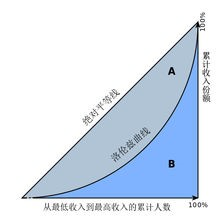
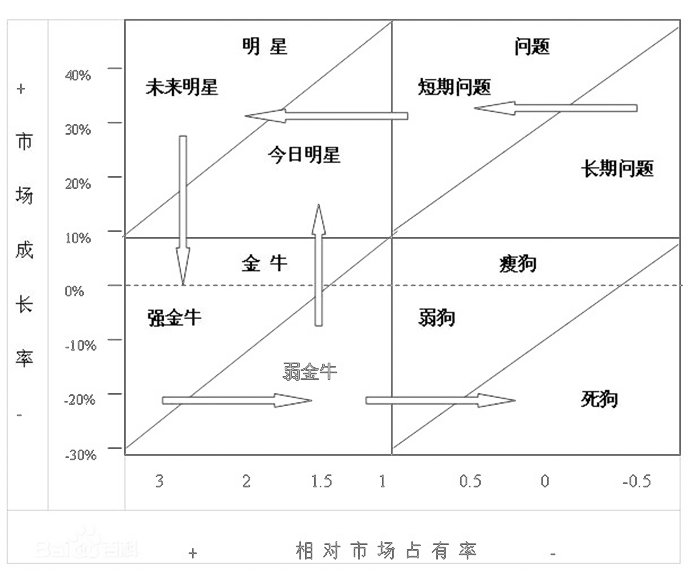

**2018市场营销期末复习**

**单项选择**

**1、市场营销的观念：**生产观念、产品观念、推销观念、营销观念、社会营销

**营销观念的变迁：**

现代营销的核心——以顾客为核心；

社会营销的观念——不仅关注企业本身，也要关注社会责任，例如环保、原材料的浪费

**2、SWOT分析：**优势、劣势、机会和威胁

3、恩格尔系数与基尼系数

**恩格尔系数：**食品支出总额占个人消费支出总额的比重。

**基尼系数(A/(A+B))：**用以衡量一个国家或地区居民收入差距的常用指标。如果A为零，基尼系数为零，表示收入分配完全平等；如果B为零则系数为1，收入分配绝对不平等。

4、企业所处的环境分为宏观环境、微观环境

宏观环境：PEST（Politics政治、Economy经济、Society社会、Technology技术）

5、四个战略：市场渗透、市场开发、产品开发、产品多元化

**举例：**农夫山泉婴儿水，受众原为婴儿，扩展受众为孕妇，该战略称为**产品开发战略**

**6、BCG矩阵**

**问题产品 (Question)：**高增长，低市场份额

**明星产品（Stars）：**高增长，高市场份额

**现金流产品（Cash Cows）：**低增长，高市场份额

**瘦狗型产品（Dogs)：**低增长，低市场份额

7、顾客满意是什么：当商品的实际消费效果达到消费者的预期时，即顾客感知大于期望，就导致了满意；否则，则会导致顾客不满意

顾客让渡价值：是指企业转移的，顾客感受得到的实际价值。

顾客让渡价值=顾客购买总价值-顾客购买总成本

**8、无差异化战略的优点：**可以通过大批量生产降低单位产品成本、可以减少广告促销费用、可以减少市场调研及制定多种市场组合方案等带来的成本开支

**营销三大战略：**成本领先战略、无差异化战略、集中战略

9、产品生命周期：开发期、介绍期、成长期、成熟期、衰退期

**多项选择 5\*3**

**1、竞争导向定价方法：**随行就市、差别竞争、竞争价格定价、投标方法

**2、消费者购买决策过程：**确认需要、信息收集、方案评价、购买决策、购买后行为

**3、竞争战略理论：**总成本（全面）领先战略——成本低廉**、**差异化战略——与众不同**、**集中（聚焦）战略——市场突破

**4、消费者市场细分标准(宏观因素)：**地理因素**、**人口因素**、**心理因素**、**行为因素

**5、直销的形式**

电视购物**、**电话购物**、**上门推销**、**自动售货机、网上直销、面对面直销、直接邮寄营销、购物目录营销、新数字技术、信息亭营销等

**判断题 10\*2**

1.  **什么是市场**：人口+购买力+欲望

>   **需要：**人类感到缺乏的一种状态

>   **欲望：**需要的一种派生形式，受社会文化和个性的限制

>   **需求：**当考虑到支付能力的时候，欲望就转化为需求

**2、商标、品牌——企业的无形资产**

**3、定价方法的种类：**基于顾客价值、成本、竞争的定价方法

**4、消费品中的选购品和特殊品最佳的营销方法：**不是密集分销

**5、发展新顾客比保留老顾客成本高**

**6、节假日商场打折销售属于什么定价方法：**折扣定价，不是竞争定价

**7、售后服务属于产品概念中的什么层次——延伸产品**

**8、促销的实质是信息沟通**

**9、渠道层次越多越难管控**

**简答题 2\*10**

**1、产品生命周期**

**周期：**开发期、介绍期、成长期、成熟期、衰退期

**成长期特点及其应对策略：**

**特点：**销售量增加、单位成本下降、竞争加剧、市场细分

**策略：**改进产品，突出特色、进入细分市场、创新品牌、管控分销渠道、进行价格策略

**2、一般定价方法**

**内部因素：**成本、产品差异、销售力量、定价目标

**外部因素：**竞争因素、消费者需求、政府力量、市场整体

**综合题**

**案例题：营销（传）原理+（教材术语）+分析+个人感想**

**4P理论：**4P理论是一种营销理论，即Product（产品）、Price（价格）、Place（渠道）、Promotion（促销）。

**STP理论：**市场定位理论，即Segmenting（市场细分）、Targeting（目标市场）、Positioning（市场定位）三个英文单词的缩写。

**PEST分析模型：**PEST分析是指宏观环境的分析，一般都应对Political（政治）、Economic（经济）、Social（社会）和Technological（技术）这四大类影响企业的主要外部环境因素进行分析。

**SWOT理论：**优势、劣势、机会、威胁
